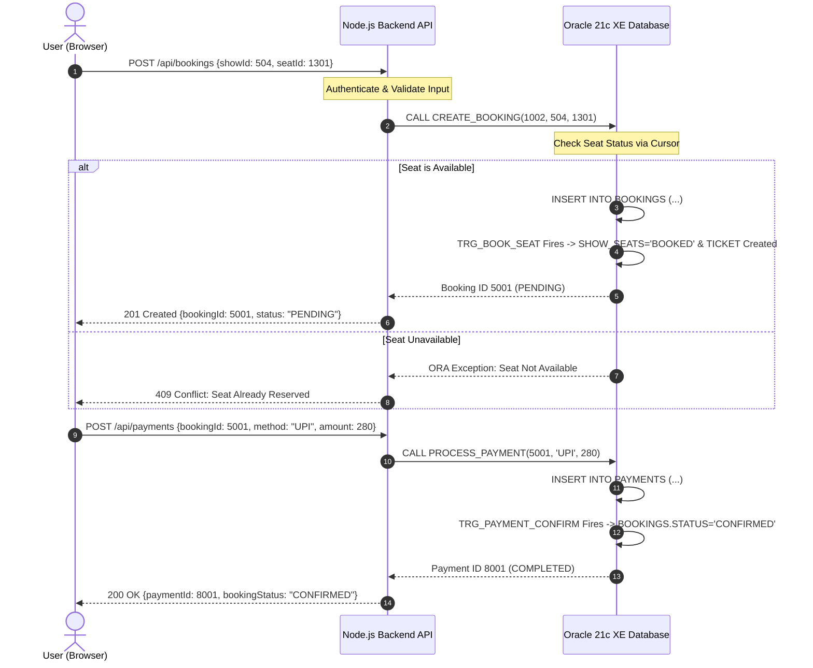

# CineGo — System Architecture Specification

## 1. High-Level Architecture Overview

**CineGo** is an enterprise-grade full-stack Movie Ticket Booking Platform engineered with a multi-tier decoupled architecture:

```
┌─────────────────────────────────────────────────────────────┐
│                       CLIENT LAYER                          │
│     React 18 + TypeScript + Vite + Tailwind CSS (SPA)       │
│   • Customer Portal   • Admin Console   • Manager Portal    │
└──────────────────────────────┬──────────────────────────────┘
                               │ HTTPS / JSON REST API
                               ▼
┌─────────────────────────────────────────────────────────────┐
│                      APPLICATION LAYER                      │
│            Node.js + Express + TypeScript API Server        │
│   • JWT & Supabase Auth Middleware                          │
│   • Role-Based Access Control (RBAC: Customer/Admin/Mgr)    │
│   • Request Validation (Zod)                                │
│   • Controllers & Services (Business Orchestration)         │
│   • Repositories (Parameterized Oracle Bind Variables)      │
└──────────────────────────────┬──────────────────────────────┘
                               │ Connection Pool (oracledb)
                               │ localhost:1522/XEPDB1
                               ▼
┌─────────────────────────────────────────────────────────────┐
│                       DATABASE LAYER                        │
│                  Oracle Database 21c XE                     │
│   • 19 Relational Tables with Full Integrity Constraints   │
│   • 10 Oracle Sequences (Auto-Increment Identity)           │
│   • 22 PL/SQL Stored Procedures                             │
│   • 2 Authoritative Stored Functions                        │
│   • 3 Event-Driven Triggers (ACID State Transitions)        │
│   • Implicit & Explicit Cursors                             │
│   • Read Committed Transaction Isolation Level              │
└─────────────────────────────────────────────────────────────┘
```

---

## 2. Layer Responsibilities & Decoupling

### 2.1 React Frontend
- **Responsibilities**:
  - Presentation of movie discovery, cinema geolocation, and seat maps.
  - Interactive seat state visualizer: `AVAILABLE` (green border), `SELECTED` (blue), `LOCKED` (orange), `BOOKED` (gray).
  - Client-side route protection based on decoded JWT claims.
  - Generative DBMS demonstration interfaces (`/db-architecture`, `/dbms-demo`).
- **Boundaries**:
  - Direct connection to Oracle DB is strictly forbidden.
  - Authoritative pricing, seat locking, and coupon math are delegated to backend Oracle functions.

### 2.2 Express API Backend
- **Responsibilities**:
  - Connection pooling with `oracledb` pool (`poolMin: 2`, `poolMax: 10`).
  - Parameterized execution with Oracle bind variables (`:p_param`) to guarantee SQL-injection immunity.
  - Global error interception mapping Oracle ORA error codes into friendly HTTP error responses.
  - Decoupling database state from UI presentation formats.

### 2.3 Oracle Database & PL/SQL Engine
- **Responsibilities**:
  - Authoritative source of truth for all transactional entities.
  - Enforcing database integrity via constraints (`PRIMARY KEY`, `FOREIGN KEY`, `CHECK`, `UNIQUE`).
  - Encapsulating transactional operations in PL/SQL stored procedures with explicit `COMMIT` and `ROLLBACK` blocks.
  - Automatic side-effect execution via PL/SQL Triggers:
    - `TRG_BOOK_SEAT`: Generates tickets & locks seats upon booking insertion.
    - `TRG_PAYMENT_CONFIRM`: Promotes pending bookings to confirmed upon completed payment.
    - `TRG_RELEASE_SEAT`: Frees seats and issues automated refund records upon booking cancellation.

---

## 3. Component Communication Flow


