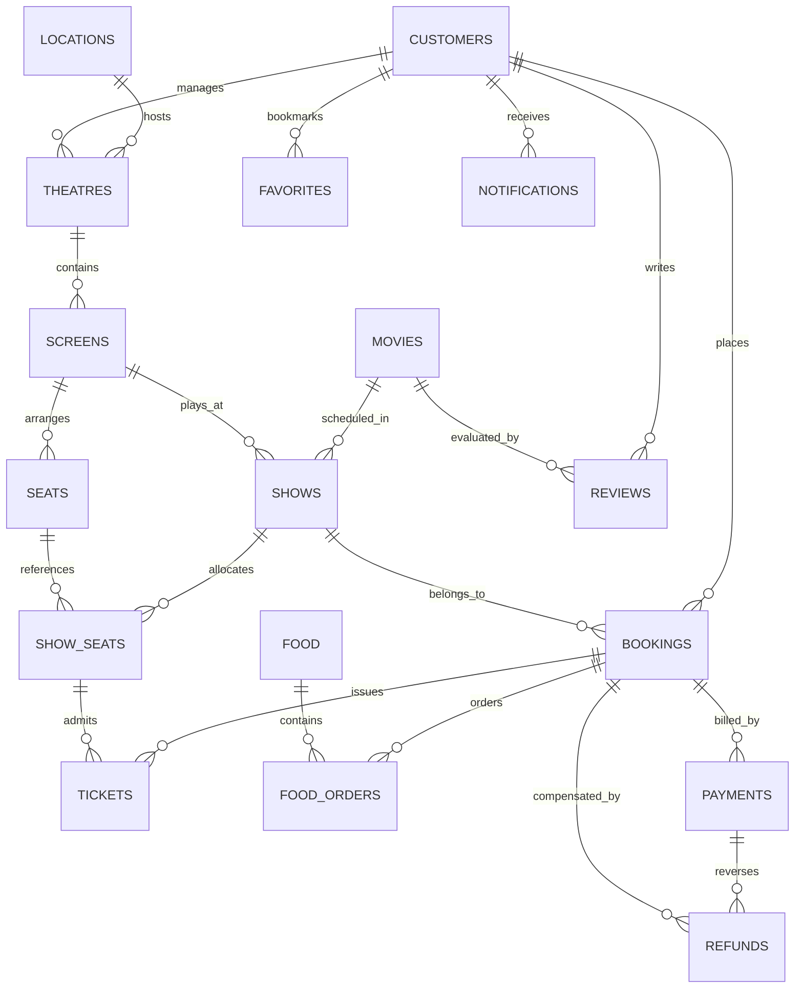

# CineGo — Oracle Database Architecture & ER Specification

## 1. Database Specifications

- **Database Engine**: Oracle Database 21c Express Edition (XE)
- **Pluggable Database (PDB)**: `XEPDB1`
- **Default Listener Port**: `1522`
- **Isolation Level**: Read Committed (with Oracle multiversion read consistency)
- **Authoritative PL/SQL Logic**: Stored Procedures, Stored Functions, Sequences, Triggers, Explicit & Implicit Cursors

---

## 2. Entity-Relationship (ER) Diagram



---

## 3. Relational Schema Summary

| Table | Primary Key | Foreign Keys | Key Constraints & Checks |
|---|---|---|---|
| `CUSTOMERS` | `CUSTOMER_ID` | None | `EMAIL UNIQUE`, `MOBILE UNIQUE`, `ROLE IN ('CUSTOMER','ADMIN','THEATRE_MANAGER')` |
| `LOCATIONS` | `LOCATION_ID` | None | `CITY NOT NULL`, `IS_ACTIVE CHECK (0, 1)` |
| `MOVIES` | `MOVIE_ID` | None | `RATING BETWEEN 0 AND 5`, `STATUS IN ('RUNNING','UPCOMING','COMPLETED','CANCELLED')` |
| `THEATRES` | `THEATRE_ID` | `LOCATION_ID` -> `LOCATIONS`, `MANAGER_ID` -> `CUSTOMERS` | `NAME NOT NULL` |
| `SCREENS` | `SCREEN_ID` | `THEATRE_ID` -> `THEATRES` | `TOTAL_SEATS > 0` |
| `SEATS` | `SEAT_ID` | `SCREEN_ID` -> `SCREENS` | `UNIQUE(SCREEN_ID, ROW_NAME, SEAT_NUMBER)`, `SEAT_TYPE IN ('REGULAR','PREMIUM','RECLINER','ACCESSIBLE')` |
| `SHOWS` | `SHOW_ID` | `MOVIE_ID` -> `MOVIES`, `SCREEN_ID` -> `SCREENS` | `BASE_PRICE > 0` |
| `SHOW_SEATS` | `SHOW_SEAT_ID` | `SHOW_ID` -> `SHOWS`, `SEAT_ID` -> `SEATS` | `UNIQUE(SHOW_ID, SEAT_ID)`, `STATUS IN ('AVAILABLE','LOCKED','BOOKED','CANCELLED')` |
| `BOOKINGS` | `BOOKING_ID` | `CUSTOMER_ID` -> `CUSTOMERS`, `SHOW_ID` -> `SHOWS` | `STATUS IN ('PENDING','CONFIRMED','CANCELLED','EXPIRED')` |
| `TICKETS` | `TICKET_ID` | `BOOKING_ID` -> `BOOKINGS`, `SHOW_SEAT_ID` -> `SHOW_SEATS` | `STATUS IN ('ACTIVE','CANCELLED','USED')` |
| `FOOD` | `FOOD_ID` | None | `PRICE >= 0`, `IS_VEG CHECK (0, 1)` |
| `FOOD_ORDERS` | `FOOD_ORDER_ID` | `BOOKING_ID` -> `BOOKINGS`, `FOOD_ID` -> `FOOD` | `QUANTITY > 0`, `SUBTOTAL >= 0` |
| `COUPONS` | `COUPON_ID` | None | `CODE UNIQUE`, `DISCOUNT_TYPE IN ('PERCENTAGE','FLAT')` |
| `PAYMENTS` | `PAYMENT_ID` | `BOOKING_ID` -> `BOOKINGS` | `PAYMENT_METHOD IN ('UPI','CARD','NET_BANKING','WALLET')`, `PAYMENT_STATUS IN ('PENDING','COMPLETED','FAILED','REFUNDED')` |
| `REFUNDS` | `REFUND_ID` | `BOOKING_ID` -> `BOOKINGS`, `PAYMENT_ID` -> `PAYMENTS` | `STATUS IN ('INITIATED','PROCESSING','COMPLETED','FAILED')` |
| `REVIEWS` | `REVIEW_ID` | `CUSTOMER_ID` -> `CUSTOMERS`, `MOVIE_ID` -> `MOVIES` | `UNIQUE(CUSTOMER_ID, MOVIE_ID)`, `RATING BETWEEN 1 AND 5` |
| `FAVORITES` | `FAVORITE_ID` | `CUSTOMER_ID` -> `CUSTOMERS` | `UNIQUE(CUSTOMER_ID, ENTITY_TYPE, ENTITY_ID)`, `ENTITY_TYPE IN ('MOVIE','THEATRE')` |
| `NOTIFICATIONS` | `NOTIFICATION_ID`| `CUSTOMER_ID` -> `CUSTOMERS` | `TITLE NOT NULL`, `IS_READ CHECK (0, 1)` |
| `AUDIT_LOG` | `LOG_ID` | None | `ACTION NOT NULL` |

---

## 4. Oracle Sequences

Generated via Oracle Sequence Generator (never `MAX(id) + 1`):

1. `CUSTOMER_SEQ`: Starts at 1000
2. `BOOKING_SEQ`: Starts at 5000
3. `TICKET_SEQ`: Starts at 7000
4. `PAYMENT_SEQ`: Starts at 8000
5. `REFUND_SEQ`: Starts at 9000
6. `REVIEW_SEQ`: Starts at 3000
7. `NOTIFICATION_SEQ`: Starts at 1
8. `AUDIT_LOG_SEQ`: Starts at 1
9. `FOOD_ORDER_SEQ`: Starts at 1
10. `SHOW_SEAT_SEQ`: Starts at 1

---

## 5. PL/SQL Stored Procedures

| Procedure Name | Parameter Signature | Purpose & DBMS Concept |
|---|---|---|
| `REGISTER_CUSTOMER` | `(p_name, p_email, p_mobile, p_password)` | Sequence insertion with duplicate validation |
| `LOGIN_CUSTOMER` | `(p_email, p_password)` | Implicit cursor lookup with hashed credential match |
| `SELECT_LOCATION` | `()` | Explicit cursor iterating through all active cities |
| `SELECT_MOVIE` | `(p_location_id)` | Cursor join across `MOVIES, SHOWS, SCREENS, THEATRES` |
| `SELECT_THEATRE` | `(p_location_id, p_movie_id)` | Explicit cursor filtering cinemas offering specific title |
| `SELECT_SHOW` | `(p_movie_id, p_theatre_id, p_show_date)`| Explicit cursor retrieving active schedules |
| `VIEW_AVAILABLE_SEATS` | `(p_show_id)` | Explicit cursor filtering available seat inventory |
| `CREATE_BOOKING` | `(p_customer_id, p_show_id, p_show_seat_id)` | Transaction block (`COMMIT/ROLLBACK`), checks seat state |
| `ORDER_FOOD` | `(p_booking_id, p_food_id, p_quantity)` | Computes subtotal from menu pricing |
| `PROCESS_PAYMENT` | `(p_booking_id, p_payment_method, p_amount)`| Inserts payment & invokes confirmation trigger |
| `GENERATE_TICKET` | `(p_booking_id)` | Multi-table join cursor generating e-admission pass |
| `VIEW_BOOKING_HISTORY` | `(p_customer_id)` | Cursor retrieving customer's historical admissions |
| `CANCEL_BOOKING` | `(p_booking_id, p_customer_id)` | Validates ownership & transitions status to CANCELLED |
| `VIEW_REFUND_STATUS` | `(p_booking_id)` | Cursor displaying status of reverse payment |
| `ADD_REVIEW` | `(p_customer_id, p_movie_id, p_rating, p_text)`| Sequence insertion preventing duplicate submissions |
| `ADD_MOVIE` | `(p_movie_id, p_title, p_lang, p_genre, p_dur)` | Admin procedure adding new film entry |
| `UPDATE_MOVIE` | `(p_movie_id, p_title, p_status)` | Admin procedure updating runtime status |
| `REMOVE_MOVIE` | `(p_movie_id)` | Soft-delete setting status to CANCELLED |
| `CREATE_SHOW` | `(p_id, p_movie_id, p_screen_id, p_date, p_time, p_price)` | Auto-generates `SHOW_SEATS` inventory via cursor loop |
| `VIEW_BOOKING_REPORT` | `()` | Explicit cursor calculating aggregate box office revenue |
| `VIEW_THEATRE_BOOKINGS`| `(p_theatre_id)` | Scoped manager cursor filtering admissions by cinema |
| `VIEW_FOOD_MENU` | `()` | Cursor listing available refreshments |

---

## 6. Stored Functions

### `CALCULATE_TICKET_PRICE(p_show_id NUMBER, p_num_seats NUMBER) RETURN NUMBER`
Computes authoritative pricing by querying base admission from `SHOWS` and adding mandatory convenience fee of ₹30 per seat:
$$\text{Total} = (\text{Base Price} \times \text{Seats}) + (\text{Convenience Fee} \times \text{Seats})$$

### `APPLY_COUPON(p_coupon_code VARCHAR2, p_order_amount NUMBER) RETURN NUMBER`
Validates coupon active flag, expiration date, usage limit, and minimum order threshold. Computes flat or percentage discount (capped by maximum allowance) and increments `USED_COUNT`.

---

## 7. Event-Driven PL/SQL Triggers

### 1. `TRG_BOOK_SEAT`
```sql
CREATE OR REPLACE TRIGGER TRG_BOOK_SEAT
AFTER INSERT ON BOOKINGS
FOR EACH ROW
...
```
- **Triggering Event**: `AFTER INSERT ON BOOKINGS`
- **Action**: Immediately transitions `SHOW_SEATS.STATUS` to `'BOOKED'` and creates corresponding `TICKETS` admission pass using `TICKET_SEQ.NEXTVAL`.

### 2. `TRG_PAYMENT_CONFIRM`
```sql
CREATE OR REPLACE TRIGGER TRG_PAYMENT_CONFIRM
AFTER INSERT ON PAYMENTS
FOR EACH ROW
WHEN (NEW.PAYMENT_STATUS = 'COMPLETED')
...
```
- **Triggering Event**: `AFTER INSERT ON PAYMENTS`
- **Action**: Updates associated `BOOKINGS.STATUS` to `'CONFIRMED'`.

### 3. `TRG_RELEASE_SEAT`
```sql
CREATE OR REPLACE TRIGGER TRG_RELEASE_SEAT
AFTER UPDATE OF STATUS ON BOOKINGS
FOR EACH ROW
WHEN (NEW.STATUS = 'CANCELLED' AND OLD.STATUS != 'CANCELLED')
...
```
- **Triggering Event**: `AFTER UPDATE OF STATUS ON BOOKINGS`
- **Action**: Releases all referenced `SHOW_SEATS` back to `'AVAILABLE'`, invalidates `TICKETS`, and creates an automated refund record under `REFUNDS` using `REFUND_SEQ.NEXTVAL`.
